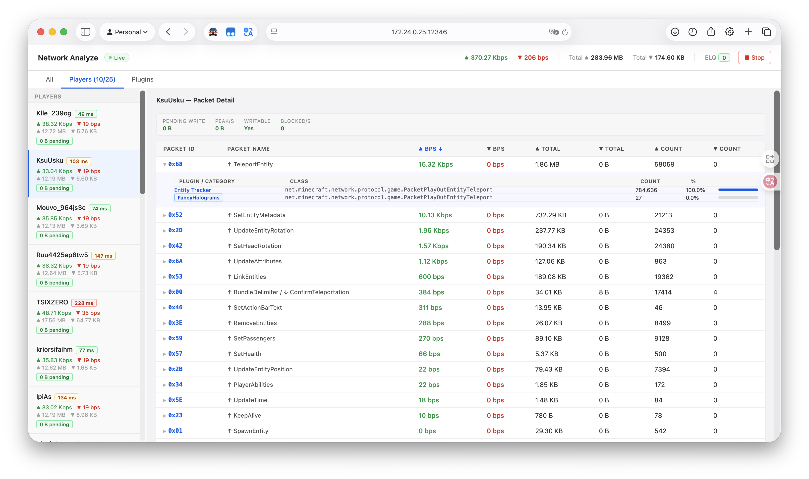

# NetMan

Real-time network packet analysis for Paper servers. You probably need this.

> Paper 1.20.1 only. No, we won't support your version.



## Setup

```
./gradlew build
java -javaagent:netman-agent-1.0.0.jar -jar paper.jar
```

You'll figure out where the jars go.

## Usage

```
/nm start [port]
/nm stop
/nm status
```

Dashboard at `http://<server-ip>:<port>`. Default port `12345`.
